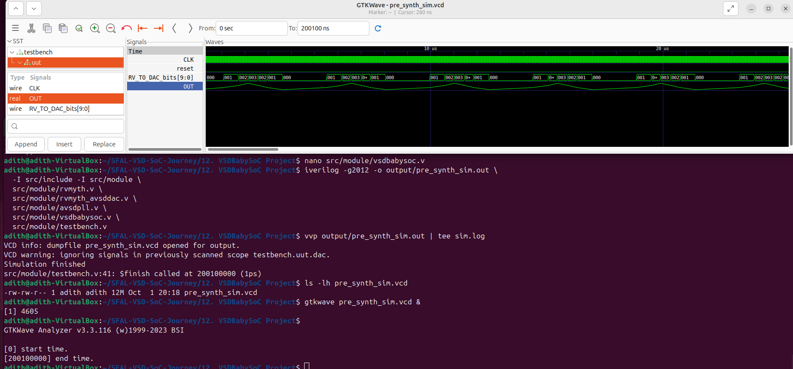

# Week 2 — BabySoC Fundamentals & Functional Modelling  

In **Week 0**, I set up my environment and tools. In **Week 1**, I dived into the basics of Verilog, ran my first RISC-V core (RVMYTH) simulations, and got comfortable with Icarus Verilog and GTKWave.  

Now in **Week 2**, I moved one step further into **System-on-Chip design** by working with **BabySoC** — a minimal RISC-V based SoC that ties together the RVMYTH CPU, a PLL, and a 10-bit DAC.  

The main focus was to perform **pre-synthesis functional simulations** and understand how hardware modules interact when actual software runs on the CPU.  

---

## What I produced this week
- Notes on the underlying SoC theory (this write-up).  
- Functional simulation logs + `.vcd` waveforms.  
- GTKWave screenshots with short explanations.  

---

## What is a SoC?

A **System-on-Chip** basically puts the main parts of a computer—CPU, memory, interconnect, and peripherals—onto a single chip.  
In real life this makes devices smaller, cheaper, and more efficient. BabySoC is stripped down so that we can actually see how each part works in simulation.

---

## Key Blocks in BabySoC

## BabySoC Block Diagram

- **RVMYTH CPU** — executes instructions.  
- **Memory** — small ROM/RAM for instructions and data.  
- **Bus** — connects CPU to peripherals with simple handshakes.  
- **DAC (10-bit)** — memory-mapped peripheral that converts digital values into analog output.  
- **PLL** — gives a stable system clock.  
- **Reset logic** — makes sure the CPU starts cleanly.  

---

## Why It’s a Good Teaching Model

- Simple enough to follow, but still a real SoC.  
- Every important signal (reset, clock, PC, bus, DAC) is visible in waveforms.  
- Simulations run fast so iteration is quick.  
- Shows the link between **software instructions → hardware signals → real output** (like sound).

---

## Functional Modelling (Before Synthesis)

## Functional Modelling Flow

The idea here is to check if the design works functionally before worrying about timing or gates.

**Benefits:**
- Find design bugs early.  
- Quick turnaround compared to gate-level sims.  
- Lets me see how code running on the CPU drives hardware.  

**Tools I used:**
- `iverilog` + `vvp` for simulation.  
- `gtkwave` for waveform viewing.  

---

## Simulation Flow (What I Did)

1. Installed/used `iverilog`, `vvp`, `gtkwave`.  
2. Compiled top-level modules (`vsdbabysoc.v`, `rvmyth`, `avsddac`, `avsdpll`, `testbench.v`).  
3. Made sure `$dumpfile` and `$dumpvars` were in the testbench:  

   ```verilog
   initial begin
     $dumpfile("pre_synth_sim.vcd");
     $dumpvars(0, testbench);
   end
   ```

4. Ran:

   ```bash
   iverilog -I src/include -o build/pre_synth_sim.out \
     src/module/testbench.v \
     src/module/vsdbabysoc.v \
     src/module/rvmyth_avsddac_stripped.v \
     src/module/avsddac.v \
     src/module/avsdpll.v

   vvp build/pre_synth_sim.out | tee build/sim_log.txt
   ```

5. Opened the VCD in GTKWave and looked at:

   * `clk`, `pll_locked`, `reset`
   * `pc`, `instr`
   * `addr`, `we`, `wdata`, `valid`, `ready`
   * `RV_TO_DAC_bits`, `OUT`

---

## Waveform Screenshots I Collected
### Reset + Clock


### DAC Output


### Overview (All signals together)


---


### Why These Modules?  

- **vsdbabysoc.v** → the **top-level SoC wrapper**, connecting CPU (RVMYTH), DAC, and PLL.  
- **rvmyth_avsddac_stripped.v** → the **RVMYTH CPU core**, adapted to work with the DAC.  
- **avsddac.v** → the **10-bit DAC**, converting digital CPU outputs into analog-equivalent values.  
- **avsdpll.v** → the **PLL model**, providing a stable multiplied system clock.  
- **testbench.v** → supplies clock/reset stimulus, includes `$dumpfile`/`$dumpvars`, and instantiates the SoC.  

All together, these files represent the **functional BabySoC**. Without any one of them, the system would be incomplete (no CPU execution, no output, no realistic clock, or nothing to observe).  

---

### What the Waveform Proves  

In GTKWave I focused on the following signals:  

- **clk, pll_locked, reset**  
  - `clk` drives the simulation.  
  - `pll_locked` asserts once the PLL stabilizes, showing proper clocking.  
  - `reset` ensures the CPU starts cleanly.  

- **pc, instr**  
  - `pc` increments as instructions execute.  
  - `instr` shows the fetched instruction at each cycle.  
  - Together, these confirm the CPU is running and not stuck.  

- **addr, we, wdata, valid, ready**  
  - These are the memory bus signals.  
  - Handshake (`valid/ready`) shows proper CPU ↔ peripheral communication.  
  - `addr`, `we`, `wdata` indicate where and what data is written.  

- **RV_TO_DAC_bits, OUT**  
  - `RV_TO_DAC_bits` is the CPU’s digital output to the DAC.  
  - `OUT` is the DAC’s analog-equivalent response.  
  - When both toggle in sync, it proves CPU → DAC integration works.  

---

### Overall Outcome  

The simulation demonstrates that:  
- The **CPU executes instructions** (PC + instr).  
- The **PLL locks properly** (realistic clocking).  
- The **bus handshake works** (valid/ready protocol).  
- The **DAC responds to CPU outputs** (digital → analog interface).  

This proves that the **BabySoC system is functionally integrated and behaving correctly before synthesis**.  

---

## Simulation Log
See the full [sim.log](./sim.log) for the simulation messages.

## Waveform File
Download and open in GTKWave: [pre_synth_sim.vcd](./pre_synth_sim.vcd)

---

## Common Debugging Notes

* **Empty VCD?** Add `$dumpfile`/`$dumpvars` at top level.
* **Duplicate modules?** Check for multiple includes.
* **Port mismatch?** Double-check top-level connections.
* **DAC flat output?** Likely CPU isn’t running → check reset & PC signals.

---

## Takeaways

* Understood how a simple RISC-V SoC ties CPU, PLL, DAC, and bus together.
* Learned why functional modelling is important before synthesis.
* Practiced running a full simulation → logs → VCD → waveforms.
* Got comfortable debugging common testbench issues.
* Saw how software (lookup table + timer) directly creates hardware output (DAC writes → sound).

---
